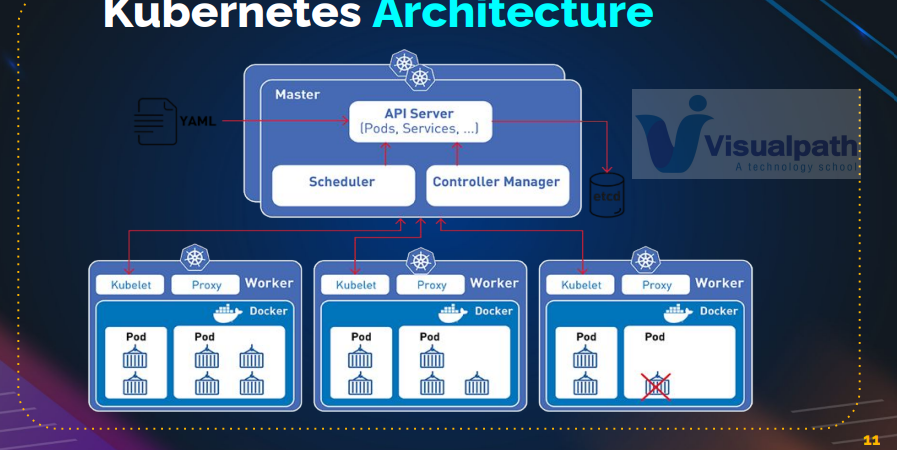
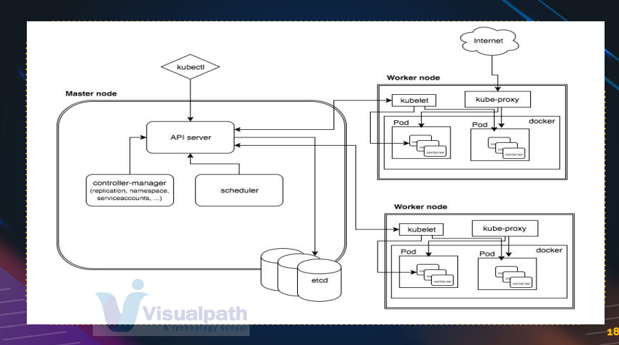
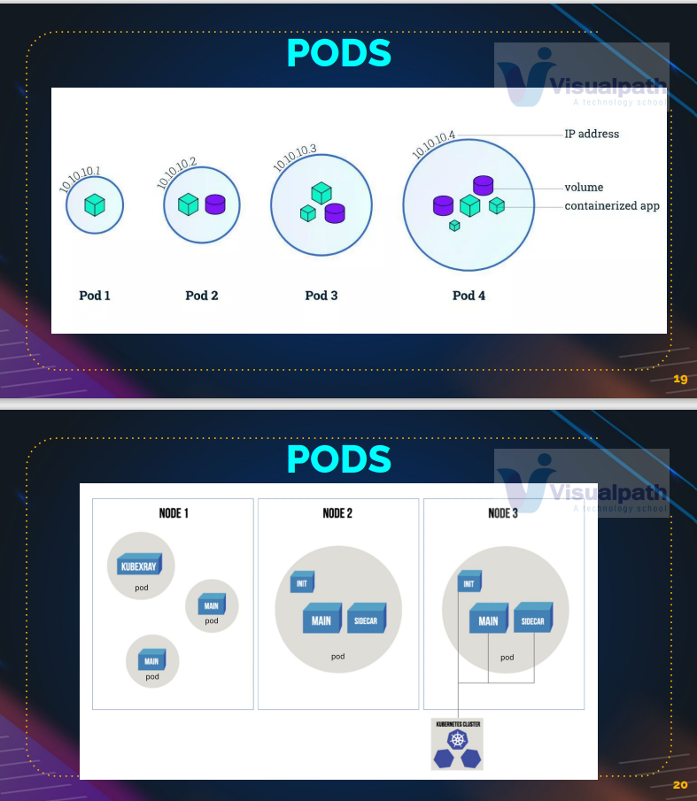
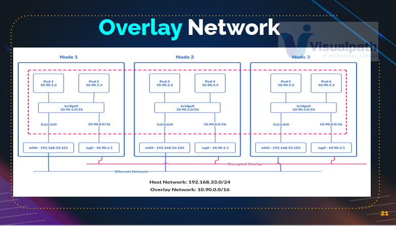
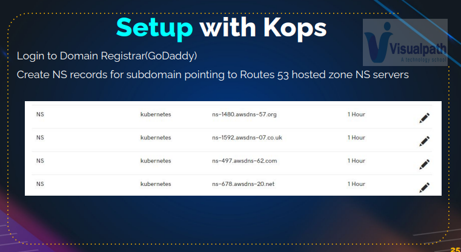

## 🚢 What is Kubernetes?

Kubernetes is the **most popular container orchestration tool** used to manage containers at scale in production environments.

---

## ❓ Why Do We Need Container Orchestration?

* Running multiple containers on a single Docker engine is fine, but:

    * **If the Docker engine fails**, all containers go down.
    * Not ideal for **high availability** or **production workloads**.

* Solution:

    * **Cluster of Docker nodes**.
    * A **master node** to manage the worker nodes.
    * This entire setup is called **Container Orchestration**.

---

## 🧠 Concept of Orchestration

* A **master node (orchestrator)** manages **multiple worker nodes**.
* Containers are distributed across nodes.
* In case of node failure, containers are:

    * Automatically restarted
    * Migrated to healthy nodes

This ensures **fault tolerance** and **high availability**.

---

## 🛠 Popular Orchestration Tools

* **Docker Swarm** (by Docker)
* **Kubernetes** (most popular)
* **Mesosphere Marathon** (Apache)
* **AWS ECS / EKS**
* **Azure Kubernetes Service**
* **Google Kubernetes Engine**
* **OpenShift**, **CoreOS Fleet**, etc.

Most cloud-based solutions are **based on Kubernetes**.

---

## 📖 Kubernetes History

* **2014**: Google announced it runs everything in **Linux containers** (\~2 billion containers/week).
* **Borg**: Internal Google tool used before Kubernetes.
* **2014**: Kubernetes open-sourced (based on Borg).
* **2015**: First stable release (v1.0), donated to CNCF.
* **2016**: Tools like `kops`, `minikube` introduced.
* **2017**: Enterprise adoption surged (GitHub, Oracle, IBM, Pokémon GO).

---

## 🧩 Kubernetes Features

* Not a replacement for Docker, but manages **clusters of container runtimes**.
* Supports:

    * **Service Discovery & Load Balancing**
    * **Storage Orchestration**
    * **Automated Rollbacks**
    * **Automatic Bin Packing**
    * **Self-Healing**
    * **Secrets & Config Management**
* Supports multiple runtimes: Docker, containerd, CRI-O, rkt

---

## ⚙️ Kubernetes Architecture

### Two Main Components

1. **Control Plane (Master Node)**
2. **Worker Nodes**

---

### 📌 Control Plane Components

| Component            | Purpose                                                                                 |
| -------------------- |-----------------------------------------------------------------------------------------|
| `kube-apiserver`     | Front-end of the cluster. Handles communication and exposes APIs.                       |
| `etcd`               | Distributed key-value store for storing cluster state.                                  |
| `kube-scheduler`     | Decides which node(or worker node) runs a Pod based on resource requirements, affinity. |
| `controller-manager` | Manages node health, replication, endpoints, tokens, etc.                               |

---

### 📌 Worker Node Components

| Component           | Purpose                                                                                                                      |
| ------------------- |------------------------------------------------------------------------------------------------------------------------------|
| `kubelet`           | Agent that runs on each worker node. Communicates with the control plane. Fetch the container and run it, map volumes to it. |
| `kube-proxy`        | Maintains network rules for Pod communication.                                                                               |
| `Container Runtime` | The actual engine running the containers (Docker, containerd, etc.).                                                         |

---




> **kubectl** is a tool to connect but **kubelet** is an agent running in the worker node 

## 📦 Pods: The Basic Unit of Deployment

* A **Pod** is the smallest deployable unit.
* A Pod contains **one or more containers**.
* Provides network, storage, and runtime abstraction for containers.



### Pod Analogy

| VM                | Pod                             |
| ----------------- | ------------------------------- |
| OS processes      | Containers                      |
| Network, CPU, RAM | Shared by containers in the Pod |

---

### Pod Configurations

* **Single container pod**
* **Pod with shared volumes**
* **Multi-container pods** (with helper containers like **init**- and **sidecars**)
* **init** containers are short lived container which just have a task at the start and then it ends.
* **sidecars** would work parallely with the main container and perform operations like logging etc.

> **Best Practice**: One main container per pod; others are helpers.

---

## 🌐 Networking in Kubernetes

* **Overlay Network**: Like a VPC, connects all nodes in the cluster.
* Each node:

    * Has a **bridge (bridge0)** for intra-node Pod communication.
    * Uses **virtual router (wg0)** for inter-node Pod communication.

---

## 🚀 Setting Up a Kubernetes Cluster

### 1. **Minikube**

* For local testing/learning.
* Runs master and worker on a single VM.

### 2. **kubeadm**

* Production-ready setup tool.
* Requires manual steps to initialize and join nodes.

### 3. **kops**

* Ideal for production.
* Originally for AWS; now supports GCP, DigitalOcean, OpenStack.

---

## ✅ Summary

* Kubernetes enables running containers in **highly available, fault-tolerant** environments.
* It supports **self-healing, rolling updates, load balancing**, and **declarative configuration**.
* Pods are the basic units; multiple Pods run on worker nodes managed by the control plane.
* Several tools are available to set up Kubernetes clusters for local testing or production.

---

## 📚 References

* [Kubernetes Official Documentation](https://kubernetes.io/docs/)
* [CNCF Kubernetes Certifications](https://www.cncf.io/certification/)

---

# 🚀 Kubernetes Cluster Setup: Minikube & Kops

In this section, we’ll walk through how to set up a Kubernetes cluster using:

1. [Minikube](#1-minikube-setup)
2. [Kops](#2-kops-setup)

---

## 1. 🖥 Minikube Setup (Single-Node for Testing)

Minikube is perfect for local testing and learning. It runs a single-node Kubernetes cluster on your local machine.

### 🔧 Prerequisites

* **Operating System**: Windows
* **Admin Access** to PowerShell
* **Oracle VM VirtualBox** installed
* **Chocolatey** package manager installed

---

### 📥 Install Minikube and kubectl via Chocolatey

```powershell
# Install Chocolatey (if not already installed)
Set-ExecutionPolicy Bypass -Scope Process -Force; `
[System.Net.ServicePointManager]::SecurityProtocol = `
[System.Net.ServicePointManager]::SecurityProtocol -bor 3072; `
iex ((New-Object System.Net.WebClient).DownloadString('https://chocolatey.org/install.ps1'))

# Install Minikube and kubectl
choco install minikube kubernetes-cli
```

> 💡 If PowerShell shows execution policy errors, temporarily disable antivirus or update execution policy.

---

### ▶️ Start Minikube

```bash
minikube start
```

This will:

* Download the Minikube VM image
* Create and run a virtual machine in **Oracle VM VirtualBox**
* Start a Kubernetes cluster on that VM

---

### ✅ Verify Cluster Status

```bash
kubectl.exe get nodes
```

You should see a single node listed (your local Minikube VM).

---

### 🔑 kubeconfig Overview

* `kubectl` uses the `~/.kube/config` file to connect to the cluster.
* This file contains:

    * Cluster details
    * User credentials
    * Contexts (cluster + user association)

---

### 🧪 Test the Cluster

1. **Create a Deployment**:

```bash
kubectl create deployment hello-minikube --image=k8s.gcr.io/echoserver:1.4
```

2. **Check Pods and Deployment**:

```bash
kubectl get pods
kubectl get deployments
```

3. **Expose the Deployment as a Service**:

```bash
kubectl expose deployment hello-minikube --type=NodePort --port=8080
```

4. **Get the Service URL**:

```bash
minikube service hello-minikube --url
```

Open the URL in your browser — you should see the echo server response.

---

### 🧹 Clean Up Minikube Resources

```bash
#use service or svc | kubectl or kubectl.exe 
kubectl delete service hello-minikube  
kubectl delete deployment hello-minikube
minikube stop
minikube delete
```

> This will remove the VM and all related resources.

---

## 2. ☁️ Kops Setup (Production-Grade Multi-Node Cluster)

`kops` is used to set up **production-ready Kubernetes clusters** — mostly on cloud platforms like AWS.

---

### 🌐 Prerequisites

1. **Domain name** (e.g., `groophy.in`) from a provider like GoDaddy
2. **A VM** to install:

    * `kops`
    * `kubectl`
    * `AWS CLI`
    * Generate `SSH Keys`
3. On **AWS**, you'll need to:

    * Create an **S3 Bucket** (for Kubernetes state storage)
    * Create an **IAM User** with appropriate policies
    * Set up **Route53 Hosted Zone** for the domain

---

### 🧭 Setup Overview (kops)

1. **Purchase a domain**
2. **Create a VM (or use EC2)**
3. **Install tools:**

   ```bash
   sudo apt update
   sudo apt install awscli kubectl kops
   ssh-keygen -t rsa -b 4096
   ```
4. **AWS Configuration**:

   ```bash
   aws configure
   ```
5. **Create S3 Bucket**:

   ```bash
   aws s3api create-bucket --bucket <your-kops-state-store> --region <region>
   ```
6. **Create the Cluster with kops**:

   ```bash
   export KOPS_STATE_STORE=s3://<your-kops-state-store>
   kops create cluster \
     --name=<cluster-name.domain> \
     --zones=<aws-zone> \
     --state=$KOPS_STATE_STORE \
     --yes
   ```

> Detailed `kops` instructions will be explored in the next hands-on section.

---

## 📁 Project Setup with vProfile

If you're using the `vprofile` project:

1. **Clone the repo**:

```bash
git clone https://github.com/your-org/vprofile.git
cd vprofile
git pull  # if already cloned
```

2. **Switch to the Kubernetes setup branch**:

```bash
git checkout kubernetes-setup
```

3. **Navigate to the Minikube or Kops directory** as required.

---

## ✅ Summary

| Tool         | Purpose                            | Use Case                        |
| ------------ | ---------------------------------- | ------------------------------- |
| **Minikube** | Local, single-node cluster         | Testing, learning               |
| **kops**     | Multi-node cluster on AWS/GCP/etc. | Production-ready infrastructure |

Next, we will deploy a Java application onto the Kubernetes cluster!

---

# 🧰 Kubernetes Cluster Setup with Kops on AWS

## 📋 Prerequisites

### 1. Domain & DNS

* You **must own a domain** (e.g. from GoDaddy).
* You'll need to:

    * Create a **subdomain** using **Route 53 Hosted Zone**.
    * Point this subdomain to Route 53 **NS (Name Server)** records via your domain registrar (e.g., GoDaddy).

### 2. Base Linux VM

* Use either:

    * Vagrant VM, or
    * **AWS EC2 Instance** (Recommended)
* This instance is only for **Kops installation and command execution**, not part of the cluster.

### 3. Tools to Install on Base VM

* **AWS CLI**
* **kubectl**
* **Kops**
* **SSH key pair**

---

## 🖥️ Launch EC2 Instance for Kops 
> This EC2 instance is not a part of cluster, just using it to launch the cluster
### Steps:

* Region: **North Virginia (us-east-1)**
* AMI: **Ubuntu 24.04**
* Instance Type: **t2.micro (Free tier)**
* Security Group:
    * Allow **SSH (Port 22)** from your IP
* Key Pair:
    * Create new key pair (`kops-key.pem`)

---

## 🔐 IAM User Setup

* Create IAM user: `kops-admin`
* Attach Policy: `AdministratorAccess`
* Generate **Access & Secret Keys** for AWS CLI
* Run on EC2:

### AWS CLI

```bash
snap install aws-cli --classic
```

```bash
aws configure
```
    * provide access key id and secret access key
    * Region: `us-east-1`
    * Output format: `json` 

---

## 🔧 Install Required Tools

## 🔑 Generate SSH Keys

In root user home directory

```bash
ssh-keygen
# Accept all defaults
```

* Store **public key path**: `/root/.ssh/id_ed25519.pub`

---

### Install Kops - from documentation

```bash
## Downloads the binary, makes is executable and copy it to local bin
curl -LO https://github.com/kubernetes/kops/releases/latest/download/kops-linux-amd64
chmod +x kops-linux-amd64
mv kops-linux-amd64 /usr/local/bin/kops
```

### kubectl - from kubernetes documentation

```bash
curl -LO "https://dl.k8s.io/release/$(curl -s https://dl.k8s.io/release/stable.txt)/bin/linux/amd64/kubectl"
chmod +x kubectl
mv kubectl /usr/local/bin/
```

Check versions:

```bash
kubectl version --client
kops version
```

---

## ☁️ AWS Setup

### 1. S3 Bucket (Kops State Store)

* Create bucket: e.g., `kops-state-956`
* Region: `us-east-1`
* Note the bucket name for use in commands

### 2. Route 53 Hosted Zone

* Create **Public Hosted Zone**
    * Name: `subdomain.domain.com` (e.g., `**kubevpro**.groophy.in`)
* Note the **NS Records**

### 3. GoDaddy Configuration

* In your domain's DNS records (GoDaddy):

    * Create **NS record** for the subdomain (e.g., `kubevpro`)
    * Add **4 NS servers** from Route 53 hosted zone



---

## 🚀 Create Kubernetes Cluster

### Edit Configuration Command

Update placeholders accordingly:

```bash
kops create cluster \
--name=kubevpro.groophy.in \
--state=s3://kops-state-956 \
--zones=us-east-1a,us-east-1b \
--node-count=2 \
--node-size=t3.small \
--control-plane-size=t3.medium \
--dns-zone=kubevpro.groophy.in \
--node-volume-size=12 \
--control-plane-volume-size=12 \
--ssh-public-key /root/.ssh/id_ed25519.pub
```

### Apply Configuration
  * **kubevpro.groophy.in** - bucket name
```bash
kops update cluster --name kubevpro.groophy.in --state s3://kops-state-956 --yes --admin
```

* Wait \~15 minutes

---

## ✅ Validate the Cluster

```bash
kops validate cluster --name kubevpro.groophy.in --state s3://kops-state-956
```

* Should show:

    * Control plane node
    * 2 worker nodes

---

## 🔎 Verify Using kubectl

```bash
kubectl get nodes
```

* Should display all nodes

### Behind the Scenes:

* Kops creates:

    * VPC
    * Subnets
    * EC2 Instances
    * Auto Scaling Groups
    * Launch Templates
    * Security Groups
    * Route 53 DNS records (e.g., `api.kubevpro.groophy.in`)

---

## 🧼 Delete the Cluster

```bash
kops delete cluster \
--name=kubevpro.groophy.in \
--state=s3://kops-state-956 \
--yes
```

* Deletes:

    * All EC2 instances
    * VPC
    * DNS Records
    * Autoscaling groups
    * S3 configurations

---

## 💡 Tips

* **Shutdown EC2 base instance** after deleting the cluster to save cost.
* Recreate cluster anytime using:

    * `kops create cluster`
    * `kops update cluster`

---

